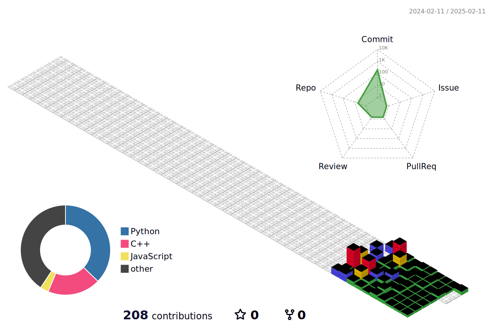

<!--  -->

<h1 align="center"> 🧑‍💻 About Me </h1>  

Welcome to my GitHub.&nbsp; 
* I'm studying in the department of Computer Science at Incheon National Univ.
* I'm interested in AI, Computer vision 💻
 

<h2 align="center">Contact Me!📥</h2> 

</a>

 <a href="https://www.instagram.com/hyukie__e">
		 

<h2 align="center">📚Tech Stack📚</h2>  

 </a>  </a> <!--</a> --> </a> </a> </a> 

<h2 align="center">🛠️ Stack Tools🛠️ </h2>  

 </a>  </a>   
 </a>    

 

  

<table>
<tr>
    <td>
	<a href="https://github.com/devxb/gitanimals">
	    
	 
	    <!-- -->
	    
      </a>
    </td>
    <td>
      

	
      

    </td>
  </tr>
</table>

